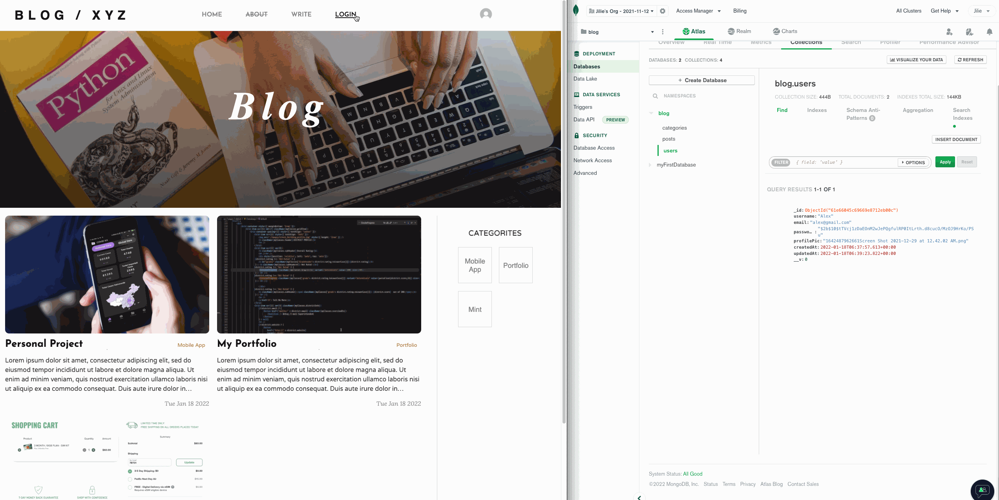
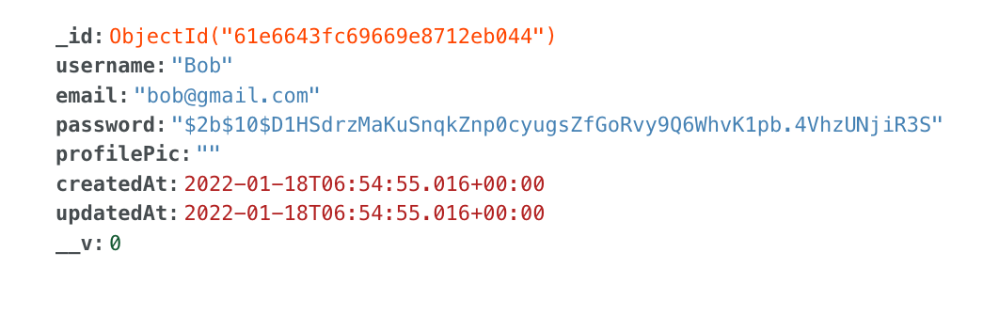
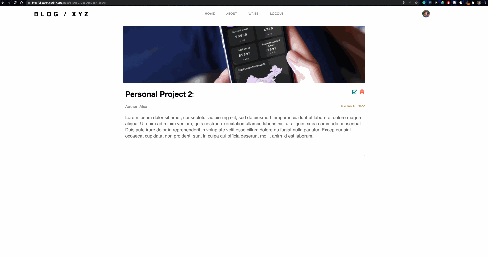
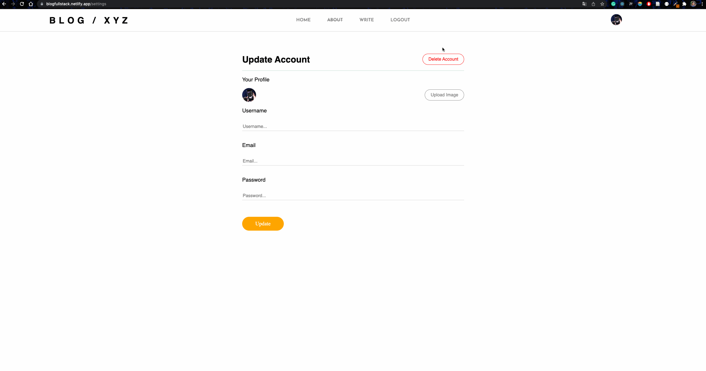
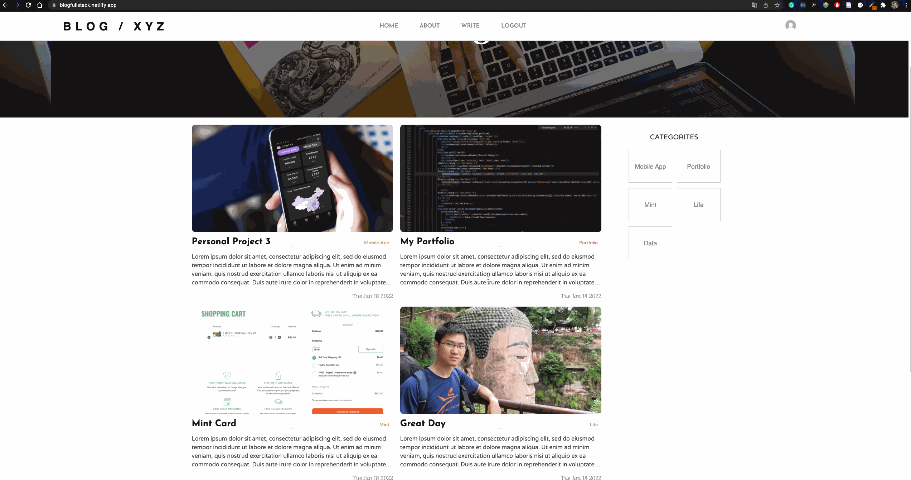
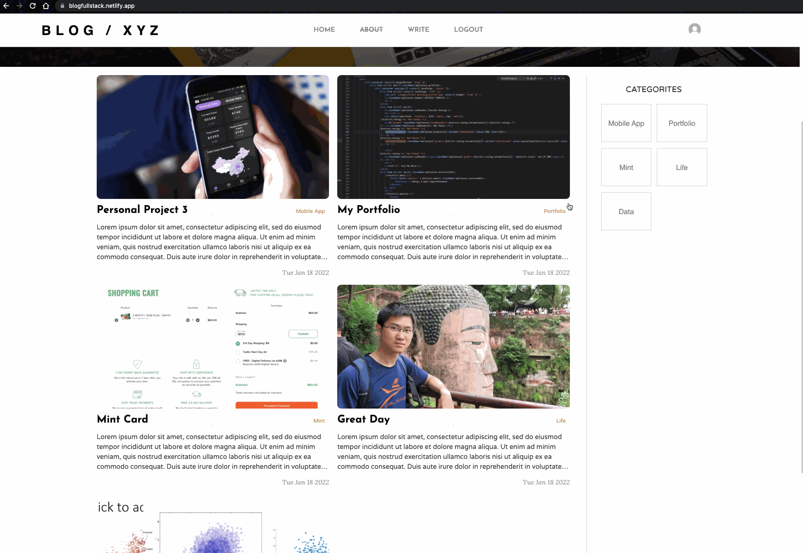
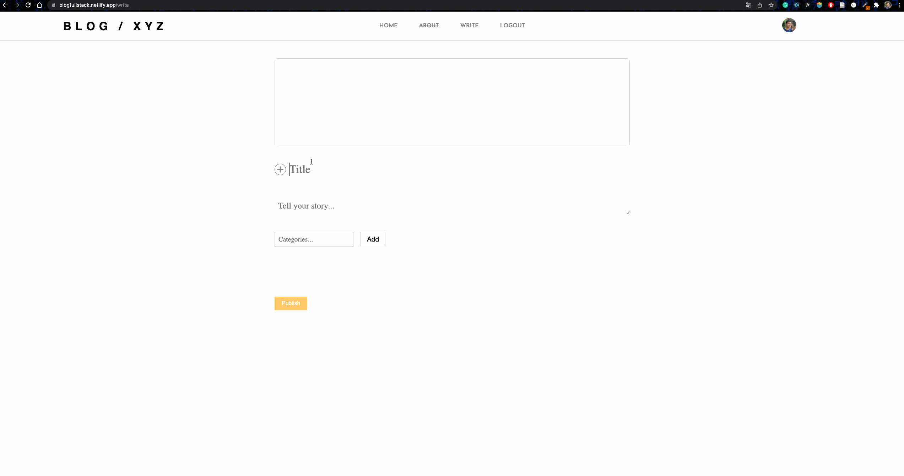
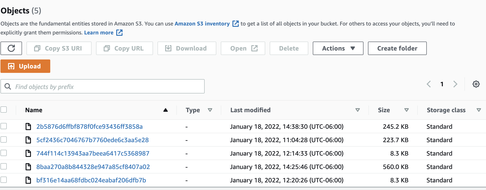

# BlOG / XYZ - fullstack project

### [Demon Stie](https://blogfullstack.netlify.app/)

## Tech Stack
**Front-End** - React.js, CSS, HTML

**Back-End** - Node.js, Express.js. MongoDB,

**Deploy** - Netlify(frontend), Heroku (backend), MongoDB Atlas (database), AWS s3 (Images)

**Dependencies** - axios, multer, bcrypt, cors, dotenv, mongoose

## Features
### User Login / Registration

### Password Encyption

### Edit/Delete Posts

### Update UserInfo

### Fetch Posts belong to a User / Category

### Responsive Website

### Write Post

### Store Image

